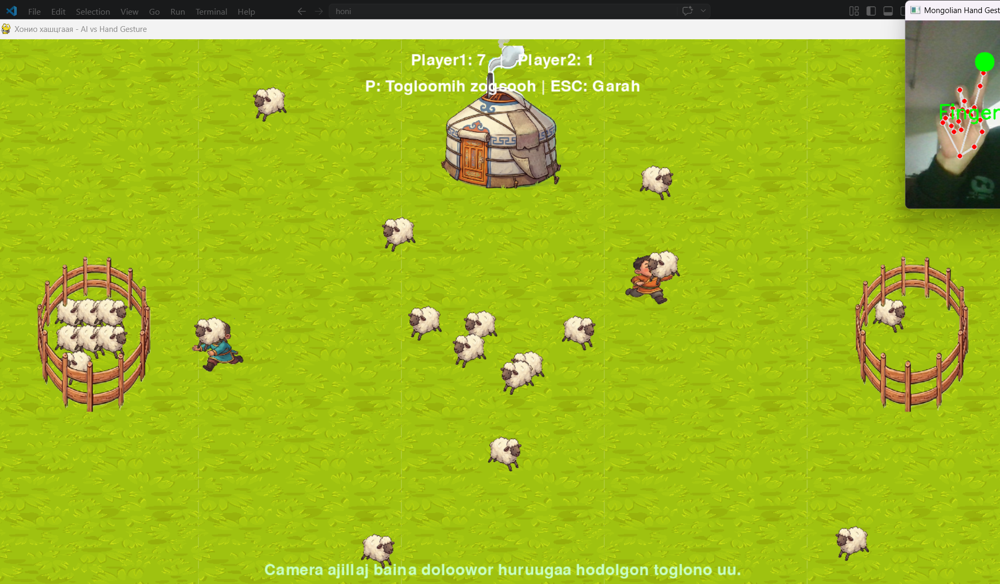

## 🐑 About the Project: AI-Driven Sheep Herding Game

This is an interactive, real-time strategy game developed using **Pygame**, **MediaPipe**, and **OpenCV**, where the player uses hand gestures to compete against an Artificial Intelligence (AI) agent in a sheep herding challenge.

### 🎮 Gameplay Mechanics
* **Player Control (Hand Gesture):** Utilizing computer vision, the system tracks the player's **index finger** using MediaPipe. Moving your finger translates directly into real-time movement of your shepherd character on the screen.
* **Objective:** Race against the AI agent to herd a target number of sheep into your designated pen. The first to secure the required number of sheep wins the match.

### 🤖 AI Agent & Algorithm Logic
The AI opponent operates based on a dynamic decision-making algorithm optimized for real-time pathfinding:
* **Distance Metric:** The agent continuously computes the **Manhattan Distance** between its current position and all active sheep on the map.
* **Target Selection:** At each game loop cycle, the AI evaluates the distance matrix, locks onto the absolute closest sheep, and dynamically steers its path toward that target.

$$D_{Manhattan} = |x_1 - x_2| + |y_1 - y_2|$$

This project effectively demonstrates the seamless integration of computer vision pipelines (MediaPipe + OpenCV) with algorithmic state machines and game physics loops in Python.

